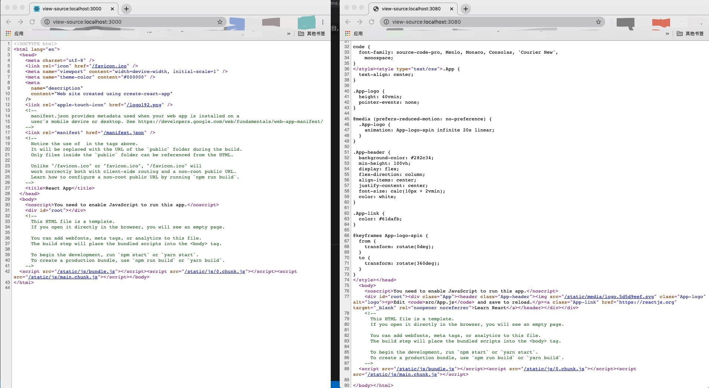

## 步骤

### 启动 SPA：在当前文件夹下打开控制台，敲如下命令：
```sh
cd ./spa
npm i
npm start
```

验证 http://localhost:3000/ 正常运行

### 启动SSR：重新在当前文件夹下打开控制台，敲如下命令：
```sh
npm i
npm start
```
验证 http://localhost:3080/ 正常运行

### 对比两份源码：在浏览器中分别敲入    
view-source:http://localhost:3000/    
view-source:http://localhost:3080/


### 正常结果

